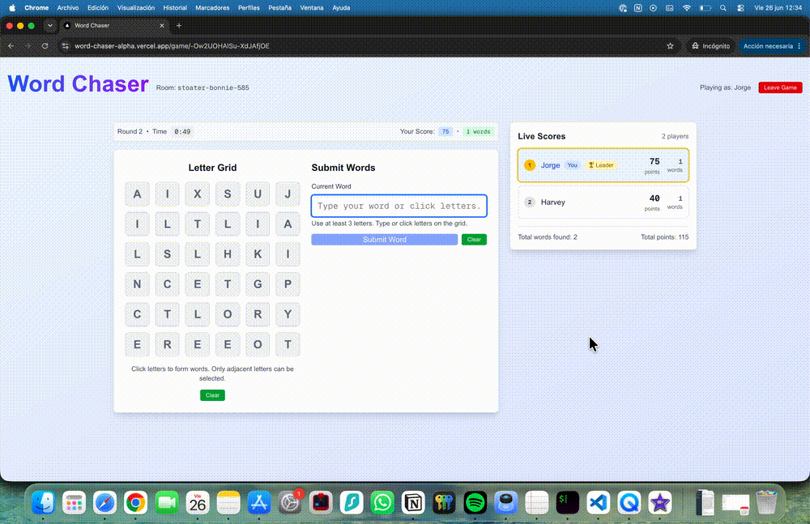
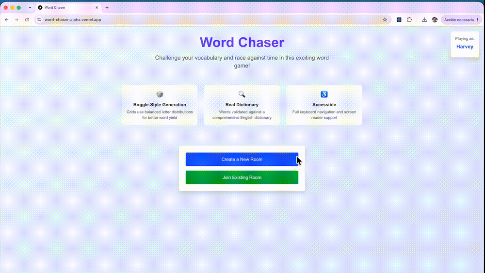

# Word Chaser

This is a documented exploration of AI-assisted software engineering, using the development of a real-time multiplayer word game - Word Chaser - as a vehicle.

My goal wasn't just to build an app, but to understand how AI changes the way experienced engineers design, build and ship software.

The project was mostly built between August and October 2025, during 13 weeks of parental leave, and provided me with the opportunity to experiment with an AI-first development workflow using the models and tools available at the time.

Rather than using AI only to generate code, I integrated it throughout the entire development lifecycle—from product discovery, design and architecture to implementation, debugging, testing and documentation.

_Active gameplay_

_Multiplayer lobby flow_

## Repository Guide

This repository is organised into two parts:

- **Case Study (this README)** — an exploration of AI-assisted software engineering through the development of Word Chaser.
- **Developer Documentation** — setup, architecture, testing and contribution guides. See [`docs/development/README.md`](docs/development/README.md).

You can also try the application here:
- **Live Demo** — [Play Word Chaser](https://word-chaser-alpha.vercel.app/) (requires two players).

## Why I Built This

My goal wasn't simply to recreate Boggle — or Yahoo Games' classic *Word Racer*, which was one of my favourite internet games as a child.

Instead, I wanted a project that was technically challenging, but still realistic to build by myself in a relatively short period of time.

Throughout the project, I set out to answer questions such as:

* How much can an experienced solo developer be accelerated?
* Where does this improvement appear most?
* What were the current limits of the technology?
* Where is my human judgment still fundamental?

## Tool Selection

The specific tools were mostly incidental. I used Cursor with the Claude Sonnet 4 model for coding and Gemini Pro for more general queries, as these were the models and editor available to me through Thoughtworks at the time.

Likewise, I chose Next.js because I had recently been working on a Next.js project and it allowed me to consolidate my learning rather than learning a new framework. For the backend, I wanted something lightweight. I decided to go serverless with Firebase because it optimised for simplicity, speed of development and cost.

While differences between LLMs naturally became apparent over the course of the project, it wasn't my aim to compare them. The primary focus was on the overall workflow rather than the capabilities of any individual tool.

## AI-assisted development

Over the main build period — from **29 July to 13 October 2025** - I designed, built and documented a fully playable real-time multiplayer word game using professional software engineering practices.

### Product & gameplay

* Multiplayer game flow with host-managed lobbies
* Guest authentication and realtime Firebase rooms
* Algorithmically generated word grids
* Dictionary-backed word validation and pathfinding
* Live scoring, rounds and final results

### Engineering

* Next.js application with Firebase backend
* Real-time multiplayer architecture
* Secure database rules

### Quality & maintainability

* Unit tests
* Firebase emulator integration tests
* Backend API tests
* Playwright end-to-end tests
* Storybook component stories
* Architecture Decision Records (ADRs)
* Spike documents and architecture diagrams

Although the original roadmap and effort estimates weren't preserved, I can say with confidence that I would never have delivered a project of this breadth and technical complexity in anywhere near the same timeframe with my regular workflow.

At the time, much of the discussion around AI focused on one-shot prompting and getting it to write software for you. Instead, I treated it as a collaborator. I had long conversations, asked lots of questions, challenged its suggestions and tried to understand the reasoning behind its output. If I didn't understand something, I'd keep asking until I did.

That said, it was able to generate large amounts of high quality code for me in a scarily short amount of time. When things went smoothly, I could finish small features in minutes and larger, cross-functional pieces of work in hours. The same work might previously have taken half a day for a small feature, or several days for a larger one. Needless to say, I was impressed. 

A less obvious benefit was that changing direction no longer felt like a costly mistake. If I realised an earlier decision wasn't ideal, the cost of revisiting it no longer seemed prohibitive. Refactoring became quicker, experimenting with alternative approaches became more practical, and I found myself more willing to improve the design rather than simply living with earlier decisions.

I also wanted to produce software that was better than I would have written on my own, while still fully understanding it. And it was important to me that the code would remain mine, with every important change reviewed and every significant decision understood. I wasn't ready to hand off full accountability just yet.

### Decision Making Through Documentation

One of the biggest surprises was how I changed my approach to documentation.

Because I was constantly trying to understand the reasoning behind technical decisions, it became natural to document them as ADRs. Since generating them took seconds rather than hours, I found myself writing far more of them than I normally would.

I started to think of ADRs as a way of asking the AI to justify its recommendations in a structured way. If it couldn't make a convincing case for a decision, it was often a sign that I needed to challenge it further or explore alternatives.

When tackling more complex technical problems, I would often ask the model to write a spike document, much as we would in an agile team. This helped me investigate options, compare trade-offs and ultimately make better decisions—for example when choosing Playwright as the E2E testing framework.

I also generated architecture diagrams throughout the project. They were quick to produce and helped me step back from the implementation details to better understand the overall system. And because I saved everything alongside the code, everything could be easily found and re-read instead of scrolling back through long chat histories.

### Testing

At Thoughtworks, testing is part of our DNA, and I've fully embraced it as a way of building safe, easily changeable software.

I wanted to see how comfortable it would be to build well tested software with AI support. One of the first rules I gave Cursor, for example, was to run the relevant tests as part of every task before considering the work complete. This slowed the workflow a little, but it more than paid for itself by catching defects early.

I was also happy for the model to write many of the test cases while I reviewed them. At the time, some people argued that tests should still be written manually for safety, but I found reviewing AI-generated tests to be no different from reviewing a pull request from a teammate. The quality assurance came from the review, not from writing every test myself.

One of the trickier parts of the project was getting meaningful Firebase integration tests running against the local emulator, particularly for the Realtime Database security rules. They took some effort to set up, but gave me confidence that the rules enforced the principle of least privilege, a key safety feature that helps prevent users from accessing or modifying data they shouldn't.

I also found the model less effective at writing Playwright end-to-end tests, so I kept those intentionally simple, smaller in number, and wrote them myself. Looking back, an MCP server — allowing the AI to interact directly with tools such as the browser and test runner — would probably have been beneficial here. I was hesitant to introduce more tooling at the time, but if the project were to continue long term, it's something I would almost certainly add.

## Failure Modes

### Rabbit Holes

Probably the biggest limitation I found was AI's tendency to disappear down rabbit holes.

When something wasn't working, the model would usually start with the conventional fix. If that didn't solve the problem, it rarely stopped to question its original assumptions. Instead, it would continue digging deeper, proposing increasingly clever but ultimately incorrect solutions that all stemmed from the same flawed understanding.

When that happened, I had to stop collaborating and go back to being a traditional software engineer: reading the code carefully, tracing the execution path and rebuilding my understanding from first principles. Once I'd identified the real cause, I could usually steer the AI back in the right direction to reach a solution quickly.

These situations weren't constant, but they happened often enough to become a recognisable pattern. In the end, I actually appreciated them because they forced me to understand parts of the system more deeply than I otherwise might have. They also exposed one of the fundamental trade-offs of AI-assisted development: the faster you code, the easier it is to become too far removed from fully understanding it.

### UX and Responsive Design

Another area where AI support was less reliable was UX and responsive design.

The model was generally good at producing clean-looking components, especially when working from an existing pattern. But it was much weaker at judging whether the overall experience actually felt good across screen sizes, input modes and real user flows.

Responsive design was a particular example of this. AI could often add the right Tailwind classes (although usually far more than I would have liked), but that didn't mean the UI had been properly designed for mobile. I still had to interact with the UI in the browser, think about the player experience and make judgment calls that were more product design than software engineering.

In fact, the mobile experience is probably the weakest part of Word Chaser. The game was originally designed for desktop, and I only realised partway through development how challenging it would be to adapt the interface for mobile. AI could help generate the code, but it wasn't particularly good at understanding what good UX felt like, so I deliberately chose not to invest too much time refining it.

This reinforced the same broader lesson: AI was helpful at producing raw material, but it didn't replace taste, user empathy or the need to actually use the thing I was building.

## Final Thoughts

One of the biggest signals I got from working on this project was whether, after completing it, I would ever want to go back to programming without AI. The answer was a very clear no.

Despite the occasional rabbit holes and frustrations, I found this way of working incredibly enjoyable and powerful. It felt much faster not just to write code, but to understand the problem, explore possible solutions and simply learn more about what I was working on.

Another surprise was that, rather than leading to the drop in quality many people worry about, AI often had the opposite effect. By reducing the cost of documentation, refactoring and exploration, it allowed me to invest more time in the parts of software engineering that improve the quality and maintainability of a system. It also made it easier to change direction when I realised a better approach existed.

Of course it wasn't all smooth sailing. The project also exposed some recurring failure modes — particularly around having to pull the model out of rabbit holes and its poor feel for good UX.

Perhaps my biggest takeaway, however, was about the question everyone has been asking: will AI replace software engineers? After spending three months building software this way, my answer is that I think we're asking the wrong question.

Today's AI is an extraordinary amplifier for an experienced engineer. It made me faster, helped me learn unfamiliar domains, challenged my thinking and removed much of the friction from documentation, testing and exploration. At the same time, it still relied on me to review its output, provide direction, exercise judgement and recognise when it was wrong. Ultimately, the quality of the software was still my responsibility.

I believe we'd be in a far better place if we focused on using AI to make software engineers better rather than trying to remove them from the process.

