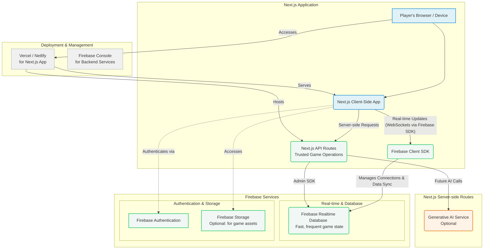

```mermaid
graph TD
    subgraph Frontend ["Next.js Application"]
        A[Player's Browser / Device] --> B(Next.js Client-Side App)
        B -- Real-time Updates (WebSockets via Firebase SDK) --> C(Firebase Client SDK)
        B -- Server-side Requests --> E
    end

    subgraph Backend ["Firebase Services"]
        subgraph Real-time & Database
            C -- Manages Connections & Data Sync --> D1(Firebase Realtime Database <br> Fast, frequent game state)
        end

        subgraph Authentication & Storage
            G[Firebase Authentication]
            H[Firebase Storage <br> Optional: for game assets]
        end
    end

    subgraph AppBackend ["Next.js Server-side Routes"]
        E(Next.js API Routes <br> Trusted Game Operations)
        E -- Admin SDK --> D1
        E -- Future AI Calls --> F(Generative AI Service <br> Optional)
    end

    subgraph Deployment & Management
        I[Vercel / Netlify <br> for Next.js App]
        J[Firebase Console <br> for Backend Services]
    end

    A -- Accesses --> I
    I -- Serves --> B
    I -- Hosts --> E
    B -. Authenticates via .-> G
    B -. Accesses .-> H

    style A fill:#e0f2f7,stroke:#3498db,stroke-width:2px
    style B fill:#e0f2f7,stroke:#3498db,stroke-width:2px
    style C fill:#f0f7f4,stroke:#2ecc71,stroke-width:2px
    style D1 fill:#f0f7f4,stroke:#2ecc71,stroke-width:2px
    style E fill:#f0f7f4,stroke:#2ecc71,stroke-width:2px
    style F fill:#fff2e6,stroke:#e67e22,stroke-width:2px
    style G fill:#f0f7f4,stroke:#2ecc71,stroke-width:2px
    style H fill:#f0f7f4,stroke:#2ecc71,stroke-width:2px
    style I fill:#f0f0f0,stroke:#95a5a6,stroke-width:1px
    style J fill:#f0f0f0,stroke:#95a5a6,stroke-width:1px
```
