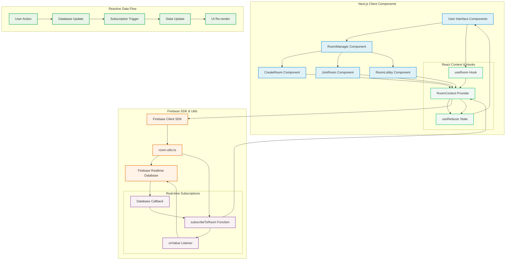

# Reactive Room Management Architecture

This diagram illustrates the reactive pattern used for room management in the Word Chaser application, showing how real-time updates flow from Firebase Realtime Database through the React context system to automatically update the UI.

## Key Components

### Frontend Layer
- **User Interface Components**: React components that render the room management UI
- **RoomManager**: Main orchestrator component that switches between different views
- **CreateRoom/JoinRoom/RoomLobby**: Specific UI components for different room states
- **State Management**: React Context and hooks that manage application state

### Firebase Integration Layer
- **Firebase Client SDK**: Official Firebase JavaScript SDK
- **room-utils.ts**: Custom utility functions for room operations
- **Firebase Realtime Database**: Real-time database for storing room state
- **Subscription System**: Real-time listeners that detect database changes

### Data Flow Layer
- **User Action**: User interactions (clicking buttons, submitting forms)
- **Database Update**: Changes made to the Firebase database
- **Subscription Trigger**: Real-time detection of database changes
- **State Update**: React state updates triggered by database changes
- **UI Re-render**: Automatic UI updates based on state changes

## Reactive Pattern Flow

1. **User performs an action** (e.g., joins a room)
2. **Component calls room utility function** (e.g., `joinRoom()`)
3. **Firebase database is updated** with the new room state
4. **Subscription listener detects the change** via `onValue`
5. **Callback function is triggered** with updated room data
6. **React Context state is updated** via `dispatch()`
7. **UI automatically re-renders** to reflect the new state
8. **User sees the updated interface** (e.g., switches to lobby view)

## Benefits of This Pattern

- **Real-time Updates**: All connected users see changes immediately
- **Automatic UI Updates**: No manual state management required
- **Consistency**: UI always reflects the actual database state
- **Reliability**: Works even after page refreshes
- **Scalability**: Handles multiple concurrent users efficiently
