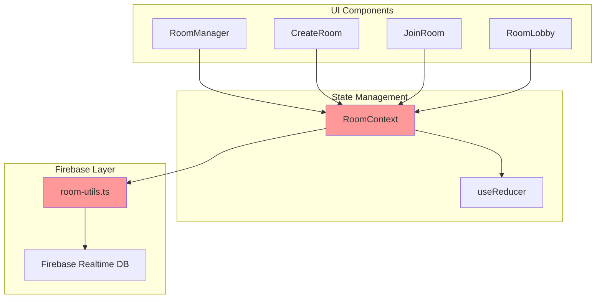
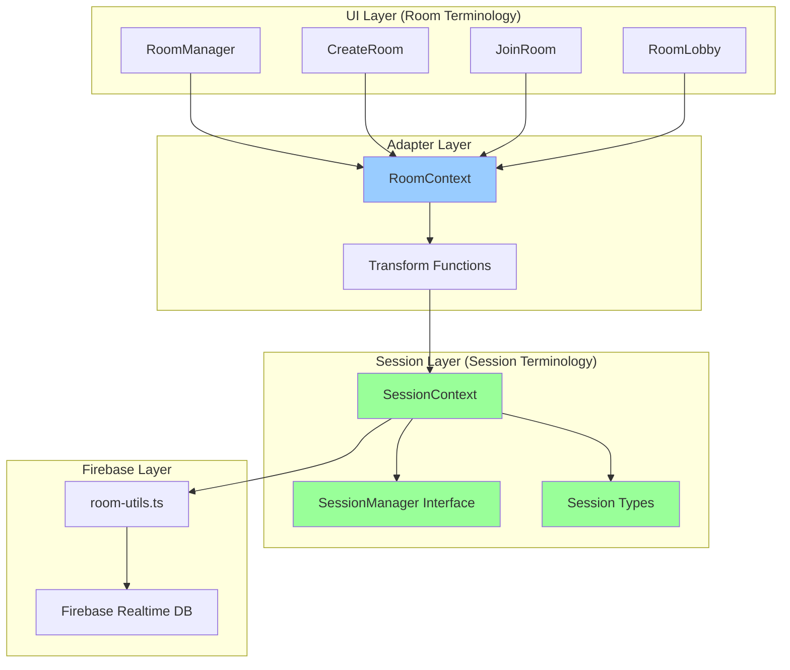
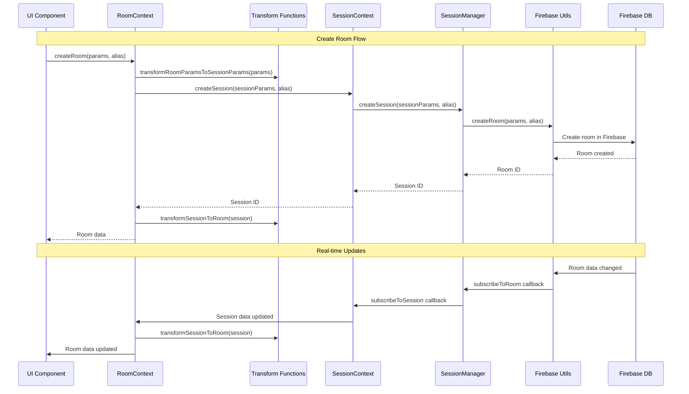
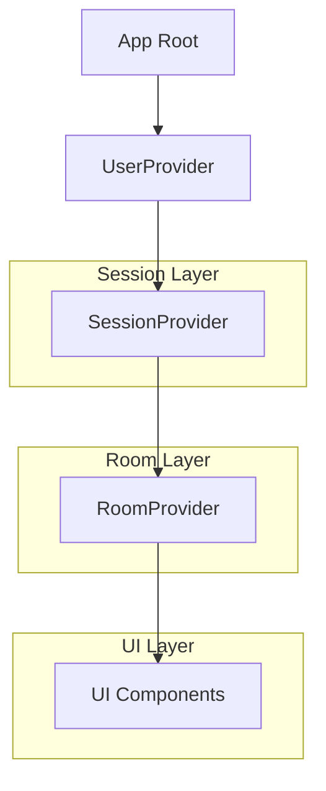
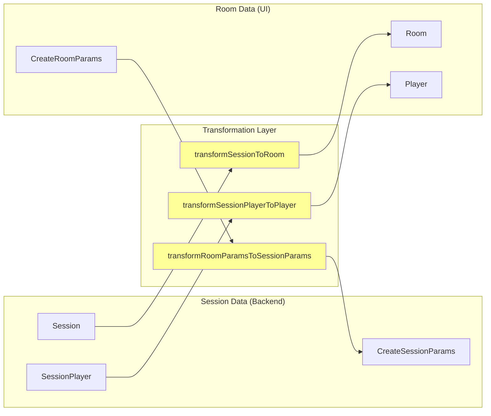
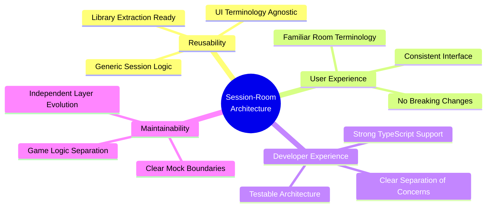
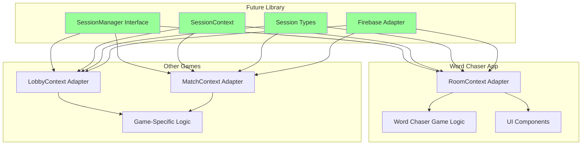
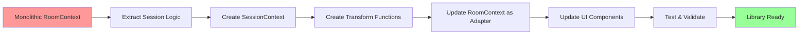

# Session-Room Architecture Diagram

## Before Refactoring (Monolithic Architecture)

**Problems:**
- Room logic mixed with Firebase implementation
- No separation between session and game logic
- Difficult to extract reusable components
- UI terminology tightly coupled to backend logic

## After Refactoring (Layered Architecture)

## Detailed Architecture Flow

## Provider Hierarchy

## Data Flow Transformation

## Key Benefits Visualization

## Future Library Extraction

## Component Responsibility Matrix

| Layer | Components | Responsibilities | Terminology |
|-------|------------|------------------|-------------|
| **UI Layer** | RoomManager, CreateRoom, JoinRoom, RoomLobby | User interface, user interactions | Room |
| **Adapter Layer** | RoomContext, Transform Functions | Data transformation, UI abstraction | Room ↔ Session |
| **Session Layer** | SessionContext, SessionManager, Session Types | Core session logic, state management | Session |
| **Firebase Layer** | room-utils.ts | Database operations, real-time subscriptions | Implementation |

## Migration Path

This architecture enables:
- **Immediate**: Clean separation of session and game logic
- **Short-term**: Building Word Chaser game logic on stable foundation
- **Long-term**: Extracting session management as reusable library
